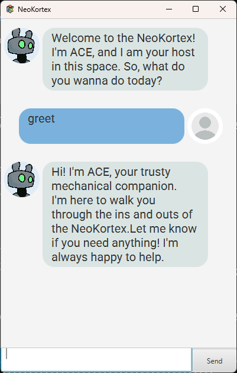
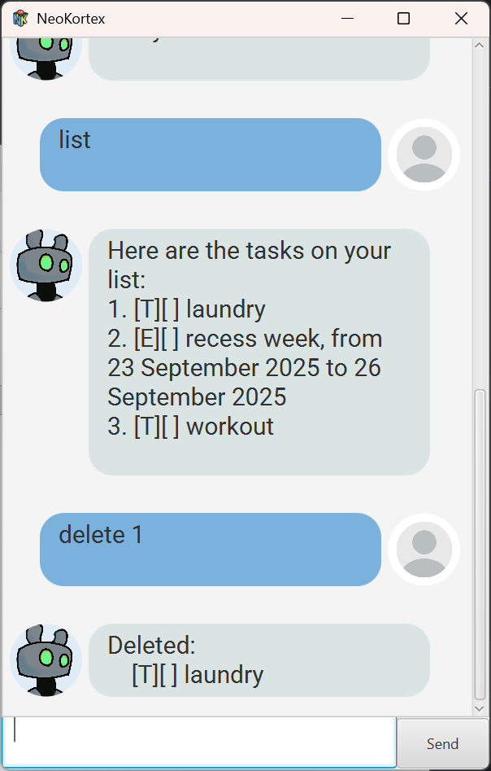
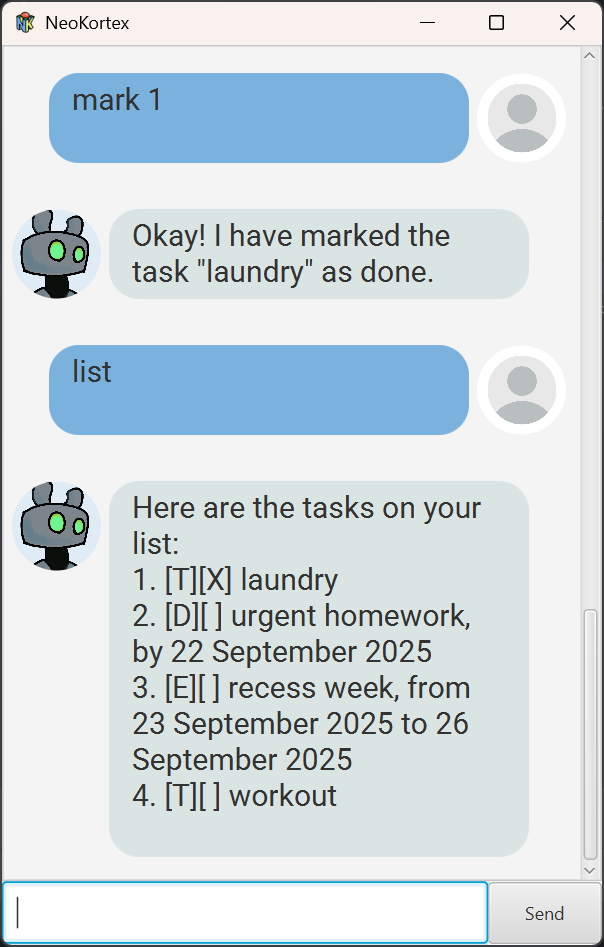

# NeoKortex User Guide


# Welcome to the NeoKortex!
The digital processing unit when your biogical one needs rest.

__Here in the NeoKortex you can:__
* Store all your troubles away
* Make room for new information
* Talk to your very own friendly and lovable companion

### What's not to love?

Speaking of which...

## Meet Ace!
Your friendly robotic companion that will guide you through the
NeoKortex.


## But before we begin...
Here's a summary of what you need to know to understand this user guide.
- \{Type t\} - Curly Braces indicates the type of input, the following word will be what we refer to it as.
- \[a/b\] - Square braces with a slash means either a or b
- \(n\)\? - Parenthesis with a question mark indicate optional parameters

And... That's it!
# Let's get started!

## Greeting Ace
The `greet` command will get ACE to introduce themselves. Say hi!

### Command Format:
`greet`

Example: `greet`


```
expected output
```


## Adding ToDos
The `todo` command allows you to add a ToDo Task with a given taskDescription. A ToDo Task is just a task that needs to be completed at some point

### Command Format:
`todo {String taskDescription}`

Example: `todo laundry`


```
expected output
```


## Adding Deadline Tasks
The `deadline` command allows you to add a Deadline Tasks with a given taskDescription and a deadline.
ACE is pretty smart, so you can be pretty lose with what time you specify as a deadline.


### Command Format:
`deadline {String taskDescription} /by {String deadline}`

Example: `deadline homework /by today!!`


```
expected output
```


## Adding Event Tasks
The `event` command allows you to add an Event Tasks with a given taskDescription, a start and 
an end time.

### Command Format:
`event {String taskDescription} /from {String startTime} /to {String endTime}`

Example: `event recess week /from tomorrow homework /to this Friday`


```
expected output
```


## Listing Tasks
The `list` command will get ACE to recite all the Tasks that you have added so far.

### Command Format:
`list`

Example: `list`


```
expected output
```


## Deleting a Task
The `delete` command will get ACE to delete the Tasks that corresponds to the number that you specify.

### Command Format:
`delete {int taskId}`

Example: `delete 1`


```
expected output
```


## Saving the TaskList
The `save` command will get ACE to save the TaskList. You can your saved TaskList in the directory ./data/ToDoList
This TaskList will now persist across instances. The next time you enter the NeoKortex, Ace will remember the TaskList
from the previous time you saved!

If you don't lilke the default save location, you can actually specify one yourself!
Just write the desired path after save.

### Command Format:
`save {String path}`

Example: `save`


```
expected output
```


## Mark a Task as done
The `mark` command will mark the Task corresponding to the TaskId provided as done.

### Command Format:
`mark {int taskId}`

Example: `mark 1`


```
expected output
```
Before:

After:


## Unmarking a Task
The `unmark` command will unmark the Task corresponding to the TaskId provided.

### Command Format:
`unmark {int taskId}`

Example: `mark 1`


```
expected output
```
Before:

After:


## Leaving the NeoKortex
The `quit` command will allow you to quit the program. ACE will even send you off with a message!
_I mean you can just exit by clicking the X icon but where's the fun in that?_

### Command Format:
`quit`

Example: `quit`


```
expected output
```


# That's All Folks!

I hope you enjoyed reading this User Guide. Now what are you waiting for? 
ACE is excited to meet you! You wouldn't leave them hanging would you?

# Thank you for reading!